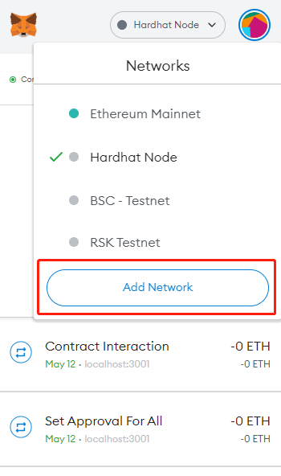
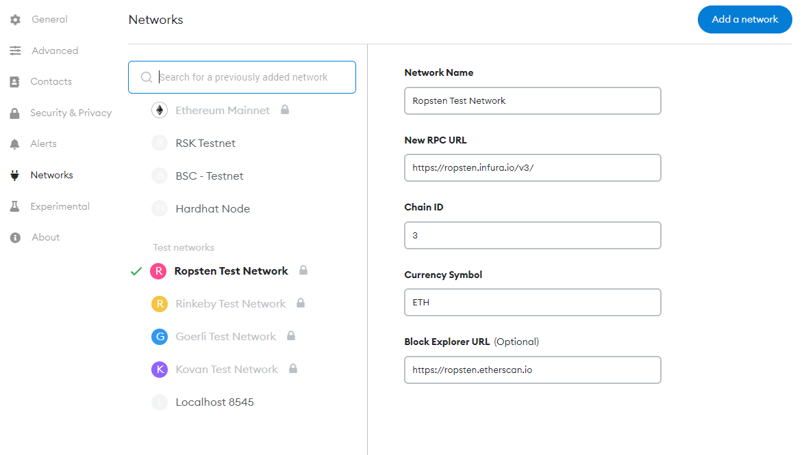
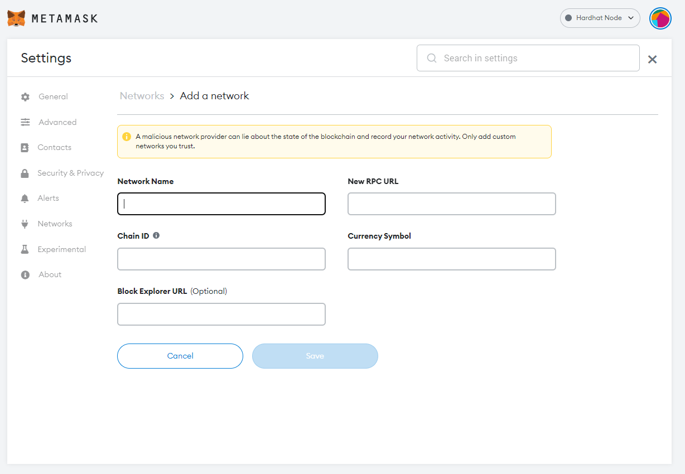
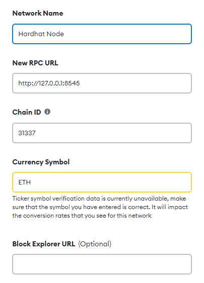

# 运行步骤

## 1. Add MetaMask wallet network: ropsten

Go to link:

https://umbria.network/connect/ethereum-testnet-ropsten

Open your MetaMask plugin and you will get a ropsten network.


Or:

Add the ropsten network like this:





## 2. Install dependencies

在根目录 `Blockchain-MysteryBoxes` 下：

```bash
npm install
```

## 3. Deploy contract

```bash
npx hardhat run src/backend/scripts/deploy.js --network ropsten
```

## 4. Test (option) 

```bash
npx hardhat test
```

## 5. Start the frontend

under root path: `Blockchain-MysteryBoxes` ：

```bash
npm start
```


Or using localhost:

## 0. Change the file: hardhat.config.js

```
require("@nomiclabs/hardhat-waffle");
require('dotenv').config();
require("@nomiclabs/hardhat-ethers");
const { API_URL, PRIVATE_KEY } = process.env;
module.exports = {
  solidity: "0.8.4",
  paths: {
    artifacts: "./src/backend/artifacts",
    sources: "./src/backend/contracts",
    cache: "./src/backend/cache",
    tests: "./src/backend/test"
  },

};
```


## 1. Add test Metamask wallet account




Add configs like this:



## 2. Install dependencies

under root path: `Blockchain-MysteryBoxes` ：

```bash
npm install
```

## 3. Set up test hardhat nodes:

```bash
npx hardhat node
```

Don't stop the terminal of the code above

## 4. Deploy contract

```bash
npx hardhat run src/backend/scripts/deploy.js --network ropsten
```

## 5. Test (option) 

```bash
npx hardhat test
```

## 6. Start the frontend

under root path: `Blockchain-MysteryBoxes` ：

```bash
npm start
```
